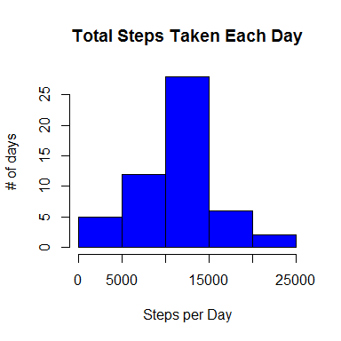
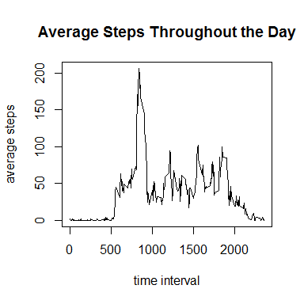
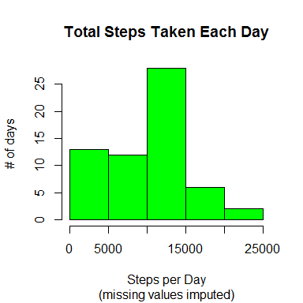
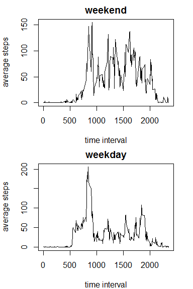

# Reproducible Research: Peer Assessment 1
SLJones  
October 17, 2015  


##Loading & Preprocessing the Data

1.  Load the data


```r
activity.df<-read.csv("activity.csv", header=TRUE)
```


2.  Process/transform the data


```r
activity.df$date2<-strptime(activity.df$date, "%Y-%m-%d")
str(activity.df)
```

```
## 'data.frame':	17568 obs. of  4 variables:
##  $ steps   : int  NA NA NA NA NA NA NA NA NA NA ...
##  $ date    : Factor w/ 61 levels "2012-10-01","2012-10-02",..: 1 1 1 1 1 1 1 1 1 1 ...
##  $ interval: int  0 5 10 15 20 25 30 35 40 45 ...
##  $ date2   : POSIXlt, format: "2012-10-01" "2012-10-01" ...
```


##What is the mean total number of steps taken per day?  
#####(ignore missing values)

1. Calculate the total number of steps taken per day


```r
totalSteps <- aggregate(steps ~ date, activity.df, sum)
```

2. Make a histogram of the total number of steps taken each day


```r
hist(totalSteps$steps, col = "blue", 
     xlab="Steps per Day",
     ylab = "# of days",
     main = "Total Steps Taken Each Day")
```

 

3. Calculate and report the mean and median of the total number of steps taken per day


```r
meanSteps<-as.integer(mean(totalSteps$steps))
medSteps<-median(totalSteps$steps)
```

**The mean steps per day is 10766 and the median is 10765 steps per day.**


##What is the average daily activity pattern?

1. Make a time series plot (i.e. type = "l") of the 5-minute interval (x-axis) and the average number of steps taken, averaged across all days (y-axis)


```r
stepInterval <- aggregate(steps ~ interval, activity.df, mean)

with(stepInterval, 
     plot(interval, steps, type="l",
          xlab="time interval",
          ylab="average steps",
          main = "Average Steps Throughout the Day"))
```

 

2. Which 5-minute interval, on average across all the days in the dataset, contains the maximum number of steps?


```r
int<-stepInterval[stepInterval$steps==max(stepInterval$steps),1]
```

**The 5-minute interval with the max number of steps begins at time 835.  The time interval is [835, 840).**


##Impute missing values

Note that there are a number of days/intervals where there are missing values (coded as NA). The presence of missing days may introduce bias into some calculations or summaries of the data.

1. Calculate and report the total number of missing values in the dataset (i.e. the total number of rows with NAs)


```r
summary(activity.df)
```

```
##      steps                date          interval     
##  Min.   :  0.00   2012-10-01:  288   Min.   :   0.0  
##  1st Qu.:  0.00   2012-10-02:  288   1st Qu.: 588.8  
##  Median :  0.00   2012-10-03:  288   Median :1177.5  
##  Mean   : 37.38   2012-10-04:  288   Mean   :1177.5  
##  3rd Qu.: 12.00   2012-10-05:  288   3rd Qu.:1766.2  
##  Max.   :806.00   2012-10-06:  288   Max.   :2355.0  
##  NA's   :2304     (Other)   :15840                   
##      date2                    
##  Min.   :2012-10-01 00:00:00  
##  1st Qu.:2012-10-16 00:00:00  
##  Median :2012-10-31 00:00:00  
##  Mean   :2012-10-31 00:25:34  
##  3rd Qu.:2012-11-15 00:00:00  
##  Max.   :2012-11-30 00:00:00  
## 
```

**There are 2,304 missing values in the steps variable.  There are no other missing values.**

2. Devise a strategy for filling in all of the missing values in the dataset. The strategy does not need to be sophisticated. For example, you could use the mean/median for that day, or the mean for that 5-minute interval, etc.

**I will find the median number of steps for all days at that 5 minute interval.  I will replace the NA with the appropriate median.**


3. Create a new dataset that is equal to the original dataset but with the missing data filled in.


```r
##copy dataset
activity2<-activity.df
activity2$steps<-as.numeric(activity2$steps)

##calculate the median number of steps at each time interval
##across all days
medianStepInterval <- aggregate(steps ~ interval, 
                                activity2, median)

##find & replace step NA's with the median for that interval
i<-1
for(i in 1:nrow(activity2)){
  if(is.na(activity2$steps[i])){
    missInt<-activity2$interval[i]
    activity2$steps[i]<-
      medianStepInterval[medianStepInterval$interval==missInt,2]
  }
}

summary(activity2$steps)
```

```
##    Min. 1st Qu.  Median    Mean 3rd Qu.    Max. 
##       0       0       0      33       8     806
```

**No more NA's.**


4. Make a histogram of the total number of steps taken each day and Calculate and report the mean and median total number of steps taken per day. Do these values differ from the estimates from the first part of the assignment? What is the impact of imputing missing data on the estimates of the total daily number of steps?


```r
##calculate total steps
totalSteps2 <- aggregate(steps ~ date, activity2, sum)

##make histogram
hist(totalSteps2$steps, col = "green", 
     xlab="Steps per Day",
     ylab = "# of days",
     main = "Total Steps Taken Each Day", 
     sub= "(missing values imputed)")
```

 

```r
##calculate mean & median
meanSteps2<-as.integer(mean(totalSteps2$steps))
medSteps2<-as.integer(median(totalSteps2$steps))
```
  
Mean with NA's: 10766  
Mean with imputed values: 9503  
  
Median with NA's: 10765  
Median with imputed values: 10395  
  
Imputing missing values with the median resulted in a decrease for both the mean and median steps per day.  


##Are there differences in activity patterns between weekdays and weekends?

For this part the weekdays() function may be of some help here. Use the dataset with the filled-in missing values for this part.

1. Create a new factor variable in the dataset with two levels - "weekday" and "weekend" indicating whether a given date is a weekday or weekend day.


```r
##change dates into days of week
activity2$day<-weekdays(activity2$date2)

##classify days of week as weekends or weekdays
i<-1
for (i in 1:nrow(activity2)){
  if(activity2$day[i] %in% c("Saturday", "Sunday")){
    activity2$weekend[i]<-"weekend"
  }
  else {activity2$weekend[i]<-"weekday"}
}
```


2. Make a panel plot containing a time series plot (i.e. type = "l") of the 5-minute interval (x-axis) and the average number of steps taken, averaged across all weekday days or weekend days (y-axis). 


```r
stepInterval2 <- aggregate(steps ~ interval+weekend, activity2, mean)

par(mfrow=c(2,1), mar=c(4,4,2,2))

with(subset(stepInterval2, weekend=="weekend"), 
     plot(interval, steps, type="l", main="weekend",
          xlab="time interval", ylab="average steps"))

with(subset(stepInterval2, weekend=="weekday"), 
     plot(interval, steps, type="l", main="weekday",
          xlab="time interval", ylab="average steps"))
```

 

**THE END.**
